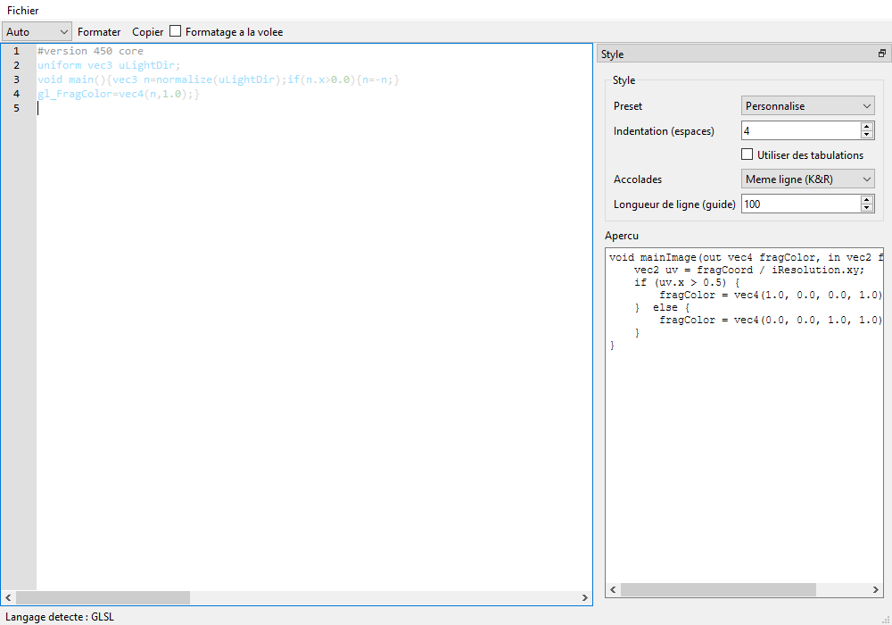

# Guide utilisateur

Ce guide décrit l'usage de l'éditeur graphique ShaderFmt. Pour compiler
et lancer l'application, voir la section "Building from source" du
[`README.md`](../README.md) à la racine du dépôt.

## Vue d'ensemble

La fenêtre principale se divise en trois zones :

- **À gauche** : l'éditeur de code (avec numéros de ligne et coloration
  syntaxique dépendant du langage sélectionné).
- **En haut à droite** : le panneau **Style**, qui contrôle comment le
  code est reformaté.
- **En bas à droite** : un **Aperçu** en lecture seule qui montre le
  résultat du formatage en temps réel, sans modifier votre texte tant que
  vous n'avez pas cliqué sur "Formater".

La barre d'état, en bas de la fenêtre, affiche le langage détecté
automatiquement (`Langage detecte : ...`) lorsque le sélecteur de langage
est sur "Auto".

## Barre d'outils

- **Sélecteur de langage** (`Auto`, GLSL, Shadertoy, HLSL, WGSL, MSL,
  ShaderLab) - sur `Auto`, le langage est détecté à partir du contenu
  collé/tapé. Choisissez un langage explicitement si la détection
  automatique se trompe sur un extrait ambigu ou trop court.
- **Formater** - applique le formatage au texte de l'éditeur, avec le
  style actuellement configuré dans le panneau Style. Le calcul se fait
  hors du thread d'interface, donc l'UI ne gèle jamais, même sur un
  fichier volumineux.
- **Copier** - copie le contenu actuel de l'éditeur dans le
  presse-papiers.
- **Formatage à la volée** (case à cocher) - lorsqu'elle est cochée, le
  texte est reformaté automatiquement après une courte pause de frappe
  (debounce de 500 ms), sans avoir à cliquer sur "Formater" à chaque
  fois.

Le menu **Fichier** propose "Ouvrir..." et "Enregistrer sous..." pour
charger/sauvegarder un fichier shader depuis le disque.

## Panneau Style

- **Preset** - une liste de styles prédéfinis (`Default`, `Shadertoy`,
  `Unreal`, `Unity`) qui ajustent en un clic l'ensemble des réglages
  ci-dessous à des conventions courantes. `Personnalise` s'affiche
  automatiquement dès que vous modifiez un réglage individuellement.
- **Indentation (espaces)** - largeur d'indentation.
- **Utiliser des tabulations** - remplace les espaces d'indentation par
  des tabulations.
- **Accolades** - `Meme ligne (K&R)` (`if (x) {`) ou
  `Ligne suivante (Allman)` (accolade ouvrante sur sa propre ligne).
- **Longueur de ligne (guide)** - repère visuel indicatif, n'entraîne
  aucun retour à la ligne automatique du code (le formateur ne réécrit
  jamais les expressions).

Vos réglages de style sont sauvegardés automatiquement (via `QSettings`)
et restaurés au prochain lancement de l'application.

## Garantie de comportement

Le formatage ne change **jamais** la sémantique du shader : uniquement
les espaces, l'indentation, et le placement des accolades/retours à la
ligne. C'est une règle non négociable du projet, vérifiée par les tests
de non-régression du dépôt (comparaison de la séquence de tokens
sémantiques avant/après formatage, et, quand un compilateur de référence
est disponible, recompilation du shader formaté).

## Limites connues

Voir la section "Known limitations" du [`README.md`](../README.md) pour
la liste à jour des limitations assumées.
